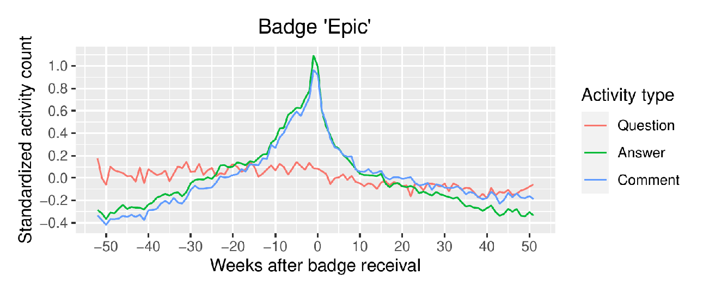
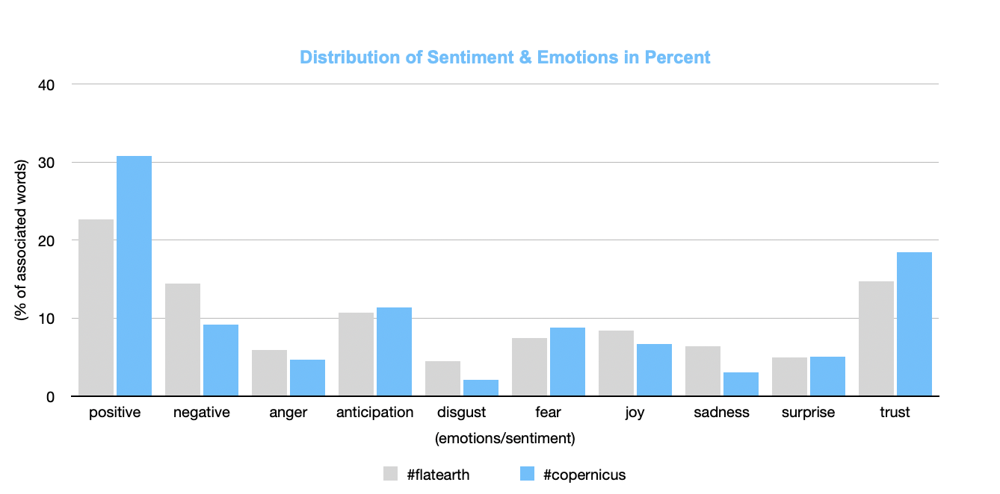

```{r xaringan-themer, include=FALSE, warning=FALSE}
#This block contains the theme configuration for the CSS lab slides style
library(xaringanthemer)
library(showtext)
style_mono_accent(
  base_color = "#5c5c5c",
  text_font_size = "1.5rem",
  header_font_google = google_font("Arial"),
  text_font_google   = google_font("Arial", "300", "300i"),
  code_font_google   = google_font("Fira Mono")
)
```

```{r setup, include=FALSE}
options(htmltools.dir.version = FALSE)
```


layout: true
<div class="my-footer"><span>David Garcia - Computational Social Systems Master's Programme - ISDS, TU Graz</span></div> 


---
class:center
# About me

.pull-left[
```{r, echo=FALSE, out.width=300}
knitr::include_graphics("figures/Profile.jpg")
```
]

.pull-right[
<br>
Website: [dgarcia.eu](https://dgarcia.eu)

Twitter: [@dgarcia_eu](https://twitter.com/dgarcia_eu)

Github: [dgarcia-eu](https://github.com/dgarcia-eu)

Email: dgarcia@tugraz.at
]

Professor for Computational Behavioral and Social Sciences at TU Graz  
Faculty member of the Complexity Science Hub Vienna  
Group leader at the Medical University of Vienna

---

# Overarching aim

**Acquire skills to understand the digital society and to seize the opportunities brought by the digital transformation.**

```{r, echo=FALSE, out.width=1100, fig.align='center'}

```

---

## Foundations of Computational Social Systems

- Mandatory course in the first semester: 5 ECTS

- In-person teaching with online materials: streaming, videos, **web handouts**, teach center discussions, and discord real-time chat

- Exercises in R (from scratch) to analyze digital traces of human behavior

- Main aim: Learning the fundamentals of computational methods and data science to study human behavior and technological phenomena in the digital society.

- Focus on opportunities, limitations, and interdisciplinarity

- Not just theory: substantial **hands on experience**

---

# Course topics

- **Introduction to Computational Social Systems**
  - Google trends to study culture and development
- **Social impact theory**
  - Testing the division of impact hypothesis with Twitter data
- **Measuring emotions and sentiment analysis**
  - Evaluating sentiment analysis methods
- **Social network analysis**
  - Analyzing a Twitter politician network
- **Complex phenomena in social networks**
  - Centrality, resilience, communities...
- **Emerging issues in computational social systems**
  - Privacy and ethics of digital trace research
  - Misinformation and polarization
  - Scientific issues: representation, bias, measurement error

---

# Multidisciplinary student projects

- Main evaluation of Foundations of Computational Social Systems
  - Extra individual points for optional exercises


- Groups of four students with at least two different backgrounds

- Presentation + short report with codes and data (e.g. github)

- Data analysis motivated by a research question that can be documented in *Introduction to Computational Social Systems*

- Coding and project practice warm up for other courses: summer school, data science seminars, master thesis, etc

---

## Student project examples: stack overflow badges

```{r, echo=FALSE, out.width=900, fig.align='center'}

```

"Impact of Badges as a Gamification Element on User Engagement in Stack Overflow", by K. Aschbacher, F. Hofer, S. Ober, D. Trenzinger
https://github.com/hofaflo/fcss_stackoverflow

---

## Student project examples: misinfo emotions

```{r, echo=FALSE, out.width=760, fig.align='center'}

```

"The Sentiment of Online Misinformation", by  D. Andrianakis, A. Azizi, M. Magalhaes Ferreira, S. S. Melcher  
https://github.com/sabsiime/FCSS_Group8

---

# Other student project topic examples

- Statistics about the influence of Elon Musk’s tweets on market prices for Tesla Inc.’ stocks and Bitcoin
- Investigating gender fairness of recommendation algorithms in the book domain
- Comparison of reactions to the official twitter account of Sebastian Kurz in the time period of beginning until the end of the second Kurz government
- Vaccination attitudes across different countries
- The impact of emotional language on engagement rates on Twitter 
- Integrating survey data from the world values survey and google search data on domestic violence during the covid 19 lockdowns
- Investigating the relationship between attitudes towards social media algorithms and the general perception of the platform
- Visibility on Twitter and in traditional newspapers of politicians in Austria


---
# Apply now!

```{r, echo=FALSE, out.width=900, fig.align='center'}

```
**More information at: [tugraz.at/go/master-css](http://tugraz.at/go/master-css)**
